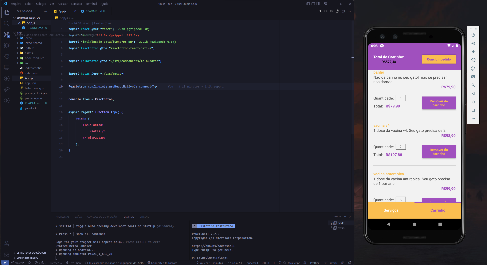

<h1 align="center">
    GATITO PET SHOP
</h1>

## Projeto

Simple aplicativo para android e ios escriot em react-native, simulando um pet shop.

## Requisitos
 - Expo
 - Android Studio ( Para simular um celular, mais você tbm pode usar seu proprio celular ) opcional
 - Reactotron ( para debugar o react-native )

## Como rodar

Baixe o repositorio
```bash
    git clone https://github.com/ItaloCobains/Gatito-Curso-React-Native
```

Baixe os pacotes
```bash
    npm i
```
Ou
```bash
    yarn add
```

A rode o projeto com
```bash
    npm start
```
Ou
```bash
    yarn start
```
Ou
```bash
    expo start
```

<h1 align="center">
    Exemplos
</h1>

<a href="#"></a>
